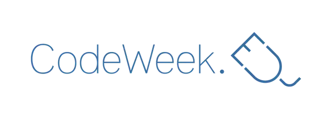
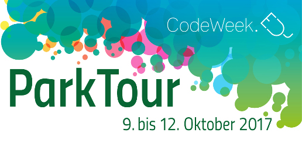
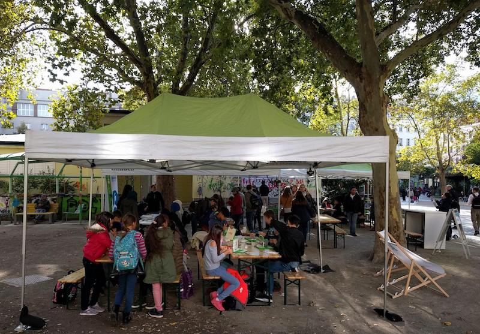

As part of this years [Europe Code Week][codeweekeu] today I and my colleagues from [CoderDojo Wien][coderdojowien] had our first day at the main event in Austria, the [CodeWeek ParkTour][codeweekat-parktour].

Togehter with several other coding initiatives we did some great outdoor coding in Scratch and C#. The weather was with us and the whole idea worked out pretty cool. Can't await the following days of hacking in the other parks.

[coderdojowien]: https://wien.coderdojo.net
[codeweekeu]: https://codeweek.eu/
[codeweekat]: https://www.codeweek.at/
[codeweekat-parktour]: https://www.codeweek.at/parktour-2017/
