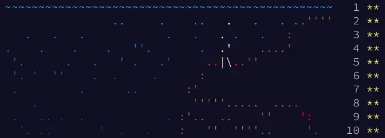

[](https://adventofcode.com/2021/day/10)

The theme for today is:
> Stack it, baby!

## Puzzle One

This reminded my of one of my university lectures on compiler construction. There we used different data structures, to efficiently store the parsed programs. Often there were trees, but the key to day 10 is the `Stack` [^2]. Accompanying I use `Dictionary` [^3] to efficiently lookup of matching brackets and gained scores.

With these data structures prepared, a test if a pair of brackets is matching results in simple lookups:
```csharp
bool Closes(char chunk, char match)
{
    if (!dict.ContainsKey(chunk))
        return false;

    return dict[chunk] == match;
}
```

Or the computation of the score:
```csharp
return errors.Select(e => syntaxPoints[e]).Sum();
```
assuming errors is a list of the first illegal bracket of each line.

## Puzzle Two

After solving the first puzzly, the second one is only a slight variation. In puzzle one you detected the corrupted lines, so the remaining ones are potentially incomplete.

To complete a line, you simply look at the remainder of the `Stack` used during analysis of the line.

```csharp
foreach (var c in chunks)
{
    score *= 5;
    score += completionPoints[dict[c]];
}
```

## Full Source

Full Source is available on GitHub. [^1]

[^1]: [https://github.com/danielwagn3r/AoC-2021/tree/main/Day10](https://github.com/danielwagn3r/AoC-2021/tree/main/Day10)
[^2]: [https://docs.microsoft.com/en-us/dotnet/api/system.collections.generic.stack-1](https://docs.microsoft.com/en-us/dotnet/api/system.collections.generic.stack-1)
[^3]: [https://docs.microsoft.com/en-us/dotnet/api/system.collections.generic.dictionary-2](https://docs.microsoft.com/en-us/dotnet/api/system.collections.generic.dictionary-2)